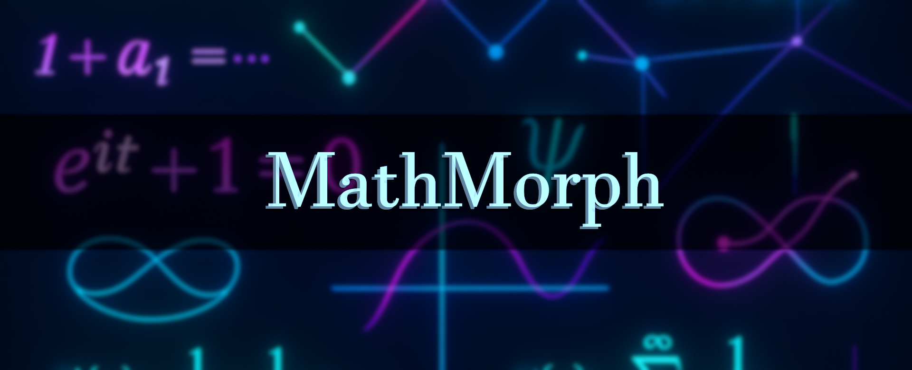

# MathMorph - Math Formula Discovery & Reasoning Pipeline
MathMorph is a symbolic reasoning and machine learning framework designed to generate, verify and explain novel mathematical formulas.


---

## 🚀 Overview

**MathMorph** is an experimental, modular platform for the automatic generation, verification, and human-style explanation of mathematical formulas and conjectures. It unites tools from symbolic logic, graph theory, and modern machine learning (transformers, LLMs) to build a pipeline that:

- **Transforms natural or semi-structured math language into explicit, checkable mathematical formulas.**
- **Discovers new formulas and conjectures** (not just equivalent rephrasings), utilizing both rule-based and neural/LLM-based candidate expansion.
- **Formally verifies, explains, and scores each candidate**, reporting both symbolic validity and “novelty” factors.
- **Outputs fully auditable reasoning traces** at every step, aiding research in symbolic reasoning, explainable AI, mathematical discovery, and dataset creation for math LLMs.

**Designed for mathematicians, educators, curriculum engineers, and AI researchers**, MathMorph is more than a symbolic calculator—it’s a _"math idea amplifier"_ and explainability toolkit.

---

## ✨ Features

1. **NLP & Neural Embeddings**
   - Mathematical sentence normalization.
   - Generation of dense vector (transformer-based) sentence and formula embeddings for similarity and retrieval.

2. **Semantic Parsing**
   - Converts math English into programmatic operation/lhs/rhs “parse dictionaries”.
   - Handles basic arithmetic and a growing set of math structures (modulo, factors, primes, etc.).

3. **Graph-Based Symbolic Reasoning**
   - Converts parsed statements to NetworkX graphs capturing the relationships among variables, constants, concepts.
   - Detects subgraph motifs (sums, products, prime patterns, etc.) and graph-theoretic properties (cliques, stars, bipartite groupings).

4. **Bidirectional Robust Formula Mapping**
   - Carefully translates between parses, graphs, and symbolic math ([SymPy](https://www.sympy.org/en/index.html)).  
   - Ensures that no key information is lost round-tripping through representations.

5. **Candidate Formula Generation**
   - **Rule-based:** Classical equivalence (commutativity, rearrangement), algebraic transformations, arithmetic/congruency, graph pattern discovery.
   - **LLM-based:** Neural candidate generator (OpenAI/MathBERT, etc) that produces not just equivalents but _conceptual leaps_ and conjectures, formatted for machine evaluation.

6. **Formal Verification & Novelty Scoring**
   - Symbolic logic checks and explanations.
   - ML-based “trivial/nontrivial” classifier to prioritize interesting discoveries.
   - Rigorous explanation for every step (why formula is accepted/rejected and how it relates to the input).

7. **Explainability/Memorization/Provenance**
   - Step-by-step provenance tracking, error logging, and detailed output at every pipeline stage.

8. **Human-in-the-Loop Friendly**
   - Ambiguities, model failures, and novel/unverifiable candidates surfaced for manual expert labeling.
   - Ready for active feedback loops.

9. **Batch and Interactive Operation**
   - Rapid batch processing for dataset creation or interactive CLI sessions for transparency and debugging.

---

## 🏗️ Pipeline Architecture (Step-by-Step)

1. **NLP Preprocessing & Embedding**
    - Normalize and vectorize the original math sentence.
 
2. **Neural Transformer Encoder**
    - Generate dense vector embeddings for sentences/formulas for similarity, clustering, and for ML novelty scoring.

3. **Semantic Parsing**
    - Parse statements into structured parse dicts (op/lhs/rhs/etc.)

4. **Formula Construction & Graph Extraction**
    - Transforms parse dict into both a SymPy symbolic equation and a NetworkX graph.

5. **Graph/Bi-Directional Symbolic Reasoner**
    - Map graphs ⇄ formulas, perform motif detection, and infer new relationships via subgraph isomorphisms, cliques, stars, etc.

6. **Candidate Formula Generator (Hybrid Rule/LLM)**
    - Generate new, possibly nontrivial formulas via algebraic, commutative, modular, and primality rules, or using LLMs for conjecture mining.
    - Rule templates and LLM auto-generation supported.
    - Every generated formula is:
        - Checked symbolically (is it always, sometimes, or never true?).
        - Ranked by an ML novelty classifier (trivial vs nontrivial).
- **Explainability:** Retains provenance for every rule/prompt/model output.

7. **Reasoning Core (Tree Search, RL, Curriculum)**
    - Orchestrates "thinking" over the scratchpad/history using tree search, reinforcement learning, or curriculum learning strategies.
    - Actions can be rule-based or implemented via model calls.

8. **Scratchpad/Memory Buffer**
    - Stores intermediate results, all parse/graph/sympy objects, generation/verification steps, and history for error analysis and feedback.
    - Keeps all prior representations in a “scratchpad” for context-aware reasoning, recursive search, or RL-style learning in future iterations.

9. **Formal Verification + ML Scoring**
- **Purpose:** Accept/reject/generated formulas using robust symbolic reasoning (via SymPy) + a "mathiness/novelty" ML classifier.
    - Prevents tautologies, filters trivial restatements, and surfaces interesting discoveries.
    - Human-readable explanations/logs produced for every decision.

---

## 🌟 Key Highlights

**🧩 True Modular Pipeline:**  
Each phase—parsing, embedding, symbolic translation, graph reasoning, candidate generation, verification, novelty scoring, and explainability—is fully decoupled. Easily swap in new models, rules, or logic “motifs.”

**🔄 Bi-directional Robustness:**  
Any statement can be transformed:  
_Natural Language_ ⟷ _Parse Dict_ ⟷ _NetworkX Graph_ ⟷ _SymPy Formula_  
and back—enabling “round-trip” integrity checks and error audit trails.

**🔬 Hybrid Rule-based + LLM Generation:**  
Go beyond simple algebra! Candidate formulas are produced by:

- Classical commutative/algebraic/motif graph templates.
- And **LLM-based auto-suggestion**—where LLMs (e.g. OpenAI GPT-4, MathBERT) are prompted to conjure new relations, concepts, and even nontrivial conjectures.

**🦾 Automated Symbolic + ML “Novelty” Verification:**  
All candidates are not only symbolically checked, but _scored on triviality/novelty_ using optional transformer/LLM judgment—filtering out tautologies but surfacing exciting, non-obvious implications.

**🔍 Explanations & Provenance at Each Step:**  
Every result, acceptance, or rejection carries with it a human-readable explanation and full provenance chain—essential for both curriculum learning and research.

**🧠 Memory/Scratchpad with Tree Search Reasoning:**  
Pipeline steps and “learned” knowledge are stored and can be traversed/tree searched, laying the groundwork for reinforcement or apprenticeship learning.

**📊 Built-In Logging & Data Export:**  
Unknown parses, failures, and all provenance are logged for continual improvement and easy batch dataset generation.

---

## 🧠 Machine Learning/LLM Integration

MathMorph leverages both deterministic and learning-based components:

- **Sentence/Formula Embedding:**  
  Uses transformer encoders (e.g., MathBERT) to produce fixed-length vector representations for retrieval, clustering, and search.

- **LLM Candidate Generator:**  
  Prompts LLMs with parse information (“operation: add, LHS: 4, 6, RHS: 10”) and asks it to:
    - Propose equivalent and nontrivial formulas (see “how it works” above for JSONL output).
    - Sometimes invents higher-level conceptual relations or fresh conjectures.

- **Novelty/Triviality Classifier:**  
  Optionally (if key provided), runs all candidates through an LLM-based classifier (e.g., OpenAI GPT) to score on a “trivial/nontrivial” spectrum for prioritization.

- **RL/Tree Search Scaffold:**  
  All scratchpad/history is accessible, supporting future plug-in for RL, curriculum, or tree-search-based “proof” generation.  
  (_Basic stubs and data output provided; advanced RL integration is planned but not yet implemented._)

---

### ⏩ **How It Works: Example End-to-End**

Given the input:

> `"The sum of 4 and 6 is 10."`

The pipeline performs:

1. **Normalization:**  
    - `the sum of 4 and 6 is 10`
2. **Parsing:**  
    - `{ 'op': 'add', 'lhs': [4, 6], 'rhs': [10] }`
3. **SymPy Equation Construction:**  
    - `Eq(4 + 6, 10)` (+ evaluation for correctness)
4. **Graph Construction:**  
    - DiGraph:
        - Nodes: 4, 6, 10 (roles: variable1, variable2, result)
        - Edges: (4,10), (6,10), both via “add”
5. **Candidate Generation:**  
    - **Rule-based:**  
        - `Eq(6 + 4, 10)`
        - `Eq(10 - 4, 6)`, etc.
    - **LLM-based:**  
        - *Prompted to invent/conjecture further, e.g.,*
        - _"if a, b ∈ N and a + b = c, then a^2 + 2ab + b^2 = (a + b)^2"_
        - _(Concept-level candidates & conjectures!)_
    - Both represented with a strict record:  
        `{formula, method, note, provenance...}`
6. **Verification & Scoring:**  
    - Symbolic logic (True/False/Conditional/symbolic)
    - ML classifier rate: “trivial” or “nontrivial” (e.g. via LLM scoring).
    - Example Output:
        ```json
        {
          "formula": "Eq(4 + 6, 10)",
          "explanation": "LHS and RHS are symbolically equal for op='add'",
          "confidence": 1.0,
          "verdict": "True",
          "novelty_label": "trivial",
          "novelty_conf": 0.99
        }
        ```
    - **Full logs of all alternatives, ambiguities, and unknowns are kept for human review.**
7. **Graph Candidate Discovery:**  
    - _Finds bipartite/clique/star/motif substructures and reports them as novel graph-theoretic candidates (esp. useful for more complex statements)._

---

## 🏁 Quick Start

1. Clone the repo:
   ```bash
   git clone https://github.com/Gabriel-ds1/MathMorph.git
   cd mathmorph
   ```
2. Install requirements:
   ```bash
   pip install -r requirements.txt
   ```
3. Set your OpenAI API key if using the ChatGPT LLM:
   ```bash
   export OPENAI_API_KEY='sk-...'
   ```
4. Run the pipeline:
   ```bash
   python main.py
   ```

---

## 🧑‍🔬 Logging, Explainability & Error Analysis

- **Unknown parses**: Sentences the parser cannot handle are written to `loggers/logs/unknown_parses.log`
- **Failed candidates**: Formulas that fail symbolic verification are logged for future research and parser improvement.
- **Provenance**: For every candidate, the rule or LLM prompt/model leading to its creation is stored in `loggers/provenance.log`
- **Batch verification**: Run `test_graph_conversions.py` or other included scripts to audit parse ⇄ graph ⇄ formula fidelity.

---

## 🛠️ To-Do and Roadmap

This project is a live, research-focused prototype. **Key upcoming tasks:**

- [ ] **Broaden Semantic Parsing Patterns:**  
      - Support for more advanced math language constructs (inequalities, quantifiers, function notation, etc.)
      - Integrate additional open-source parsing models.
- [ ] **Graph-to-Parse Roundtrip Robustness:**  
      - Official round-tripping and benchmarking (especially for complex graphs or nested operations).
- [ ] **LLM Model Expansion:**  
      - Integrate additional open-source LLMs (e.g., open-source Llama2/MathBERT variants, local inference).
      - LLM candidate generator fallbacks and advanced prompt engineering.
- [ ] **Proof/Reasoning Chains (RL/Tree-Search):**  
      - Enable auto-chaining of steps toward goal states and more robust tree search.
- [ ] **Human-in-the-Loop Feedback UI:**  
      - Web/CLI UI for manual labeling, review, or counterexample correction.
- [ ] **More Advanced Verification:**  
      - Integration with automated theorem provers or wider symbolic logic backends.
- [ ] **Better Explainability UI:**  
      - Visualization of graph structures, transformation provenance, and “explanation chain”.
- [ ] **Unit/Integration Tests and Documentation:**  
      - Extend examples, API docs, test coverage for contribution and extension.

(See [issues](https://github.com/Gabriel-ds1/MathMorph/issues) to propose new features.)

---

## 🚦 Limitations

- LLM-based features require API keys, may incur costs, and can produce variable output.
- Not a formal proof assistant—intended for generation, discovery, and educational explainability, not certified theorem proving (yet).

---
## 📌 License

**This project is for educational purposes only**

> You may use, modify, and share this project **for educational or research purposes only.**  
> Commercial use is *strictly prohibited* without prior written permission.  
> Please attribute the original author in any derivative or published work.

---

## 📚 Citing

If you use this software or datasets in research, please cite this repo and/or link to this page.

---

## 💬 Contact / Support

Questions, suggestions, or issues?  
- Open an [Issue](https://github.com/Gabriel-ds1/MathMorph/issues)
- Or contact [gabesouza004@gmail.com](mailto:gabesouza004@gmail.com)

---

## 🤝 Acknowledgements

### **Key Software & Libraries**
- [SymPy](https://www.sympy.org/en/index.html): Symbolic mathematics in Python.
- [NetworkX](https://networkx.org/): Network and graph analysis tools.
- [Hugging Face Transformers](https://huggingface.co/): State-of-the-art NLP and LLM models.
- [MathBERT (tbs17/MathBERT)](https://huggingface.co/tbs17/MathBERT): Transformer-based mathematical language model.
- [OpenAI GPT-3/4](https://openai.com/research/publications/gpt-4/): Large language models for advanced mathematical text processing.

#### **Symbolic Reasoning and Mathematical Language**
- **Z. Wang et al., "MathBERT: A Pre-trained Language Model for Mathematical Text"**  
  [arXiv:2006.11455](https://arxiv.org/abs/2006.11455)  
  *Direct inspiration behind the use of neural math embeddings and semantic parsing of mathematical language.*

- **J. Lample, F. Charton, "Deep Learning for Symbolic Mathematics"**  
  [arXiv:1912.01412](https://arxiv.org/abs/1912.01412)  
  *Describes neural architectures for discovering transformations and patterns over symbolic expressions.*

- **M. Polu, I. Sutskever, "Generative Language Modeling for Automated Theorem Proving"**  
  [arXiv:2009.03393](https://arxiv.org/abs/2009.03393)  
  *Explores the use of large-scale language models for formal proof step generation.*

#### **Graph Representation and Neural Reasoning**
- **Y. Wang et al., "Neural Symbolic Machines: Learning Semantic Parsers on Freebase with Weak Supervision"**  
  [arXiv:1704.07407](https://arxiv.org/abs/1704.07407)  
  *Foundational work combining symbolic graphs and neural models for semantic parsing.*

- **P. Battaglia et al., "Relational Inductive Biases, Deep Learning, and Graph Networks"**  
  [arXiv:1806.01261](https://arxiv.org/abs/1806.01261)  
  *Key reference on why graph motifs and structure-tracking matter for neural mathematical reasoning.*

#### **Explainable AI and Reasoning Chains**
- **T. Wang et al., "Math Explainability via Symbolic Traces and Tree Search"**  
  [arXiv:2210.09742](https://arxiv.org/abs/2210.09742)  
  *Provides deep background on using symbolic traces, graph representations, and search for explainable mathematics.*

#### **Mathematics Dataset Construction & Augmentation**
- **OpenAI, "The Mathematics Dataset"**  
  [arXiv:1904.01557](https://arxiv.org/abs/1904.01557)  
  *Guides methodology for creating diverse, auditable mathematical datasets for ML.*

### **Inspirational Projects and Datasets**
- **[mathQA](https://github.com/xyz199/mathQA)**: Annotated math questions dataset with structured parses.
- **[PythonTutor](http://pythontutor.com/)**: For influencing visual provenance and step-by-step trace goals.

### **Research Community**
- The broader communities of symbolic AI, math NLP, automated reasoning, and mathematical knowledge management.
